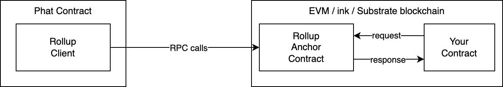

# Phat Offchain Rollup

Phat Offchain Rollup is an SDK designed to simplify the process of connecting Phat Contracts to a wide range of blockchains. Its primary focus is on providing transactional and atomic cross-blockchain operations for seamless integration and interaction.

## Table of Contents

- [The Challenge](#the-challenge)
- [Key Benefits](#key-benefits)
- [Getting Started](#getting-started)
    - [Add the Cargo Dependency](#add-the-cargo-dependency)
    - [Use the Rollup Client](#use-the-rollup-client)
    - [Request-Response Programming Model](#request-response-programming-model)
- [Integration](#integration)
    - [Deploy Offchain Rollup Anchor](#deploy-offchain-rollup-anchor)
    - [Integrate with Your Contract](#integrate-with-your-contract)
- [Examples and Use Cases](#examples-and-use-cases)
- [API Reference](#api-reference)
- [Contributing](#contributing)
- [License](#license)

## The Challenge

Developing Phat Contracts that interact with blockchains can be a common but challenging task, especially when it comes to handling concurrency issues in off-chain programs. Without a proper synchronization mechanism, Phat Contract instances may end up conflicting with each other.

Consider a real-world scenario: a smart contract distributes computation tasks to Phat Contract workers. These workers compete with each other when claiming tasks from the blockchain. Ideally, each task should only be claimed once. However, without coordination among the workers, they might send transactions simultaneously to claim the same task, resulting in inconsistent smart contract states.

Consistent state management is crucial when developing a Phat Contract that communicates with a blockchain. Developers need a reliable and **transactional** way to perform operations, where read and write tasks are combined into a single unit and executed atomically on the blockchain. This approach aligns with the **ACID** principle found in transactional database management systems.

Offchain Rollup is here to simplify Phat Contract development by providing a stable, ACID-compliant connection to various blockchains. This eliminates concurrency issues and enables a request-response programming model for seamless interaction between Phat Contracts and on-chain smart contracts.

## Key Benefits

- An on-chain gateway contract that enables seamless connectivity to Phat Contracts
- Reliable kv-store on blockchains for durable state management
    - Transactional (ACID) on-chain kv-store designed for stateful Phat Contracts
    - ACID-compliant read, write, and contract call operations for consistent data handling
- Request-response programming model that simplifies interactions between Phat Contracts and on-chain smart contracts
- Compatibility with EVM, Substrate, and ink!-powered blockchains for enhanced flexibility

## Getting Started



There are three steps to use Phat Offchain Rollup, as shown on the diagram:

1. Integrate the rollup client in the Phat Contract to connect to the anchor
2. Deploy the Anchor contract on the target blockchain
3. Integrate the anchor with your consumer contract (the smart contract that the Phat Contract interacts with)

The remaining of this section will focus on the Rollup Client integratoin. It explains how to use Phat Contract. The deployment of the anchor contract and the integration to the consumer contract will be discussed in the [Integration](#integration) section later.

### Add the Cargo Dependency

> If you are not familir with developing Phat Contract, you can start from the [Setup Wiki Page](https://wiki.phala.network/en-us/build/stateless/setup/) for details.

Update the `Cargo.toml` file in the Phat Contract project to include the phat-offchain-rollup dependency under the `[dependencies]` section:

```toml
phat_offchain_rollup = { git = "https://github.com/Phala-Network/phat-offchain-rollup.git", branch = "main", default-features = false, features = ["evm", "substrate"] }
```

Then, append the `std` feature to the `[features]` section as shown:

```toml
[features]
default = ["std"]
std = [
    "phat_offchain_rollup/std",
]
```

The `features` attribute controls the rollup target chain activation. By default, all target chains are disabled to minimize the binary size. Enable them manually using the `features` attribute. The supported features include:

- `evm`: enable the client to connect to the EVM rollup anchor contracts
- `substrate`: enable the client to connect to the Substrate rollup anchor pallet
- `ink`: (WIP)

Additionally, the `logging` feature can be used to display internal logs, including internet access, to the logger. This is helpful for debugging purposes.

### Use the Rollup Client

> In this section, the `EvmRollupClient` is chosen as the example. It's staightforward to replace it with Substrate or ink rolup clients.

To program with Offchain Rollup, the first step is to create an offchian rollup client:

```rust
let rpc = "http://localhost:8545";
let anchor_addr: H160 = hex!["e7f1725E7734CE288F8367e1Bb143E90bb3F0512"].into();
let queue_prefix = b"q/";
let client = EvmRollupClient::new(rpc, anchor_addr, queue_prefix)
    .expect("failed to create rollup client");
```

where the parameters means:

- `rpc`: The json-rpc endpoint of the target EVM compatible chain. Must be https or http (for test only).
- `anchor_addr`: The deployed anchor contract address.
- `queue_prefix`: The queue prefix. Must match the queue prefix specified when deploying the anchor contract.

Once the client is created, the core functionalities are avaialbe to use. The code below shows how to read the kv-store:

```rust
let key = b"some-key";
let value: Vec<u8> = client.session.get(key)
    .expect("failed to get value");
```

Write to the kv-store.

```rust
let key = b"some-key";
let value = b"some-value".to_vec();
client.session.put(key, value);
```

Remove an entry in the kv-store.

```rust
let key = b"some-key";
client.session.delete(key);
```

Note that the read operation may fail, since the network may fail when accessing the remote RPC endpoint. Writes are temporarily saved to the rollup client in the memory. It doesn't apply to the blockchain until you finally commit it.

Finally, commit the changes and potentially submit the rollup transaction to the target blockchain by a transaction.

```rust
let maybe_submittable = client
    .commit()
    .expect("failed to commit");
if let Some(submittable) = maybe_submittable {
    let tx_id = submittable
        .submit(pair)
        .expect("failed to submit rollup tx");
}
```

Upon a successful submission, the client should broadcast the transaction and return the `tx_id` for reference in the future. Please note that submitting a transaction doesn't guarantee the transaction will be included to the blockchain.

### Request-Response Programming Model

A typical use case of offchain rollup is to build a stable Request-Reponse connection between the Phat Contract and the blockchain. The anchor contract allows the developer to push arbitrary message to the request queue. For example, in the EVM Rollup Anchor contract, it can be done like below:

```solidity
uint id = 1000;
string tradingPair = "polkadot/usd";
bytes message = abi.encode(id, tradingPair);
IPhatRollupAnchor(anchor).pushMessage(message);
```

On the Phat Contract side, the rollup client can connect to the anchor, check the queue, and potentially reply the requests.

```rust
// Get a request if presents
if let Some(raw_req) = client
    .session()
    .pop()
    .expect("failed to read queue") {
    // let action: Vec<u8> = ... Create your response based on the raw_req ...
    client.action(Action::Reply(action));
}
```

The rollup cient provides the features to deal with the requests:

- `client.session().pop()`: Return a unprocessed request from the queue. Otherwise return `None`.
- `client.action(Action::Reply(action))`: Add a reply action to send an arbitrary `Vec<u8>` data blob back to the anchor contract.

The `Reply` actions should be paird with the `pop()`. Once a reply is committed and submitted to the target blockchain, the anchor contract will pop the pending request accordingly in an ACID way. So if the Phat Contract fails in this process, the developer can retry the execution multiple times until it succeeds.

Note that in the sample code above, the error handling is greatly simplified. In the real world scenarios, the developer should be careful about both the retry-able and non-retry-able errors. For example, a retry may be helpul with network problems, but not decoding an invalid request.

Finally the consumer contract can be configured to receive response like below.

```solidity
function onPhatRollupReceived(address _from, bytes calldata action)
    public override returns(bytes4)
{
    // Always check the sender. Otherwise you can get fooled.
    require(msg.sender == anchor, "bad caller");
    // Use `action` here.
}
```

## Integration

To build an end-to-end project with offchain rollup, the developer needs to deploy the **Offchain Rollup Anchor** contract (pallet) to the target blockchain, and integrate it with the **Consumer Contract**. The rollup anchor is prebuilt and included in this repo. The consumer contract refers to the dapp that talks to the Phat Contract.

### Deploy Offchain Rollup Anchor

Steps to deploy the EVM rollup anchor:

1. Deploy the Phat Contract with a pre-generated ecdsa key pair (called submission key)
    - Sample code: [EvmPriceFeed](./phat/contracts/evm_price_feed/lib.rs)
2. Deploy the contract [PhatRollupAnchor](./evm/contracts/PhatRollupAnchor.sol) with the parameters
    - `PhatRollupAnchor(address submitter, address actionCallback, bytes memory queuePrefix)`
    - `submitter`: The `H160` address of the submission key
    - `actionCallback`: The address of the consumer contract to receive the response
    - `queuePrefix`: The prefix of the queue. Can be an arbitrary string, but it should match the one used to create the rollup client in the Phat Contract
3. Transfer the ownership of `PhatRollupAnchor` to the consumer contract by call `anchor.transferOwnership(consumerContract)`

> TODO: We should simplify the anchor contract in:
>
> - Ownership management: merge "actionCallback" and the owner as a unified "consumer contract" role
> - Queue prefix: make it queriable by the Phat Contract, so that the developer doesn't need to specify it manually

The reference script can be found [here](./evm/scripts/deploy-test.ts).

TODO: Substrate pallet integration, ink! anchor deployment.

### Integrate with Your Contract

TODO: Add details for the consumer contract integration.

- EVM: Sample consumer contract [TestOracle](./evm/contracts/TestOracle.sol)
- ink! (WIP)
- Substrate: Sample conusmer pallet [phat-oracle-pallet](https://github.com/Phala-Network/phala-blockchain/blob/master/pallets/offchain-rollup/src/oracle.rs)

### Integration Resources

- EVM
    - [An Phat-EVM oracle sample](./phat/contracts/evm_price_feed/README.md)
    - [pink-web3](https://docs.rs/pink-web3): The web3 client to call EVM chain json-rpc and handle EVM ABI codec.
- ink! (WIP)
- Substrate
    - [An Phat-Substrate oracle sample](./phat/contracts/sub_price_feed)
    - [pink-subrpc](https://docs.rs/pink-subrpc/): The subxt-like client to call Substrate json-rpc (https-only).

## Technical Details

Please refer to the [Technical Details](./technical-details.md) page.

## Examples and Use Cases

- [Phat-EVM oracle on offchain rollup](./EvmRollup.md)
- Phat-ink oracle on offchain rollup (WIP)
- Phat-Substrate oracle on offchain rollup (Doc WIP)

## API Reference

- phat-offchain-rollup (WIP)
- [pink-kv-session](https://docs.rs/pink-kv-session/)
- EVM [PhatRollupAnchor](./evm/contracts/PhatRollupAnchor.sol)
- ink! anchor contract (WIP)
- Substrate [Offchain Rollup Anchor Pallet](https://github.com/Phala-Network/phala-blockchain/blob/master/pallets/offchain-rollup/src/anchor.rs)

## Contributing

TODO: Provide guidelines for contributing to the Offchain Rollup project, including coding standards, testing, and submitting pull requests.

## License

TODO: Specify the license used for the Offchain Rollup project.


## [Development Notes](./DevNotes.md)

Highlighted TODOs:

- Simple scheduler
- Optimization: Batch read from rollup anchor