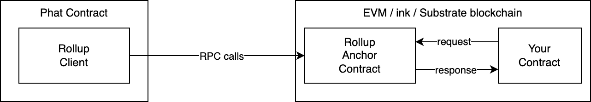

# Technical Details

## 1. Architecture and Components



**Rollup Anchor Contract**: The Offchain Rollup Anchor Contract is a smart contract deployed on the target blockchain. Its main function is to provide a versioned key-value store (kv-store) on the blockchain that allows offchain Phat Contracts to perform read/write operations.

This anchor contract also includes the implementation of the Request-Response Queue, enabling a request-response programming model for Phat Contracts while ensuring that each request receives exactly one response.

**Rollup Client**: The Offchain Rollup Client is an offchain component running in the Phat Contract project. It facilitates communication with the Offchain Rollup Anchor Contract on the blockchain, allowing developers to execute read/write operations and commit transactions.

**Consumer Contract**: The customized contract to integrate with Phat Contract with Offchain Rollup.

## 2. Design Details

### 2.1. Key-value Store and Transactional Framework

Offchain Rollup uses dedicated key-value (kv) databases for each Phat Contract stored in the anchor contract. These databases form the foundation of a transactional framework based on Multi-Version Concurrency Control (MVCC), which enables simultaneous processing of multiple read, write, and custom actions grouped as rollup transactions while ensuring atomicity and avoiding data races.

Each row in the kv store is versioned, starting from version 0 and incrementing with each update. This versioning system allows for effective conflict resolution and data consistency across concurrent transactions.

### 2.2. Rollup Transaction

Offchain Rollup's rollup transactions are structured as follows, containing a `RollupTx` struct with three main components: conditions (`conds`), actions (`actions`), and updates (`updates`):

```rust
pub struct RollupTx {
    pub conds: Vec<Cond>,
    pub actions: Vec<Bytes>,
    pub updates: Vec<(Bytes, Option<Bytes>)>,
}

pub enum Cond {
    Eq(Raw, Option<Bytes>),
}
```

* `conds`: A vector of conditions expressed as a `Cond` enum. These conditions must be met for a transaction to be valid. In the current implementation, the `Eq` condition checks if the current value associated with a key in the kv store matches an expected value. It's used for version checking in the optimistic lock.
* `actions`: A vector of custom actions encoded as bytes. Actions allow the execution of specific functions within the Phat Contract logic.
* `updates`: A vector of key-value pairs with the key as the first element of the tuple and the new value (or `None` for a delete operation) as the second element. These pairs represent the updates stored in the kv as a result of the transaction.

When a rollup transaction arrives at the anchor contract, the contract checks if the version numbers of the accessed rows match the ones specified in the transaction. If they match and all conditions are satisfied, this indicates that the transaction is working with the latest state of the data. The system then proceeds to apply updates to the kv store and execute the custom actions.

However, if the version numbers in the transaction do not match the current state of the data store, or the conditions are not met, this indicates a conflict due to another transaction modifying the data. In such cases, the transaction is dropped to maintain the integrity of the data.

### 2.3. Conflict Resolution by Optimistic Lock

Specifically, the conflict resolution in Offchain Rollup involves two steps: storing versions for each key-value pair in the kv store and validating these versions against the current state of the kv store within transaction conditions.

**Step 1: Storing versions for each key-value pair in the kv store**

For every key-value pair (k, v) in the kv store, there are two entries created:

1. The actual key-value pair: (k, v)
2. The version entry, where the key is suffixed: (k_version, version_number)

The version number starts from 0 and increases each time the key-value pair is updated.

For example, if a key-value pair with key `k1` and value `v1` is in the store, the stored data will look like this:

```
k1 -> v1
k1_version -> 0
```

If the key-value pair `k1` is then updated, the associated version number will increment:

```
k1 -> v2
k1_version -> 1
```

**Step 2: Validating the versions against the current state of the kv store within transaction conditions**

When constructing a `RollupTx`, developers must incorporate the expected version numbers within the `conds` vector, which is the version of the value it reads from the kv-store. The `Eq` condition checks if the current value associated with a key matches an expected value and if the version number found in the kv store matches the expected version number.

```rust
Cond::Eq(k1, Some(k1_version))
```

Upon receiving a rollup transaction, the anchor contract proceeds to validate the version numbers specified in the transaction conditions against the current state of the kv store. Here are the steps it follows:

1. The anchor contract extracts the version entry key (e.g., `k1_version`) from the condition.
2. It checks the corresponding value (version number) in the kv store for the extracted version entry key.
3. If the version number found in the kv store matches the expected version number from the condition and the value condition is met, the transaction proceeds to apply updates and execute actions without conflicts.
4. If the version number does not match, or the condition is not satisfied, the transaction is considered conflicting, and it is dropped to maintain consistency and data integrity.

By incorporating version checking with separate version entry keys in rollup transactions and validating them, Offchain Rollup ensures that conflicting transactions do not disrupt the consistency and atomicity of the system, maintaining the overall robustness of the blockchain environment.

By using optimistic locking, versioning, and a well-defined transaction structure, Offchain Rollup maintains consistency across concurrent transactions and ensures that only non-conflicting and valid transactions are accepted.

### 2.4. Request-Response Protocol Built on KV Store

The Request-Response Programming Model is implemented on top of the kv store, providing a simple and efficient communication system between on-chain smart contracts and off-chain Phat Contracts. It enables consumer contracts to push requests to a queue stored in the rollup kv store. Then, Phat Contracts periodically check the queue, process requests, and send responses back to the blockchain, removing processed requests from the queue.

This Request-Response model supports various use cases, such as on-demand oracles or push notifications, and allows developers to create Phat Contracts resembling standard web services, minimizing the learning curve and maintaining a familiar mental model.

By combining a transactional framework, conflict resolution through optimistic locking and versioning, and a request-response protocol built on the kv store, Offchain Rollup provides a robust and efficient solution for handling concurrency, consistency, and communication in blockchain environments.

## 3. Performance and Limitations

### 3.1. Throughput and Concurrency Advantages

Offchain Rollup introduces concurrency improvements by implementing a fine-grained optimistic lock, allowing for maximum throughput when transactions do not conflict with each other. This helps avoid data races and inconsistencies that can occur in naive methods of sending transactions directly from Phat Contracts to the blockchain.

Additionally, as Offchain Rollup operates off-chain, it is not limited by the consensus algorithm of the underlying blockchain, contributing to higher transaction-per-second (TPS) rates. The pure computation performed off-chain runs up to 10 times faster than on-chain computation and can scale linearly as more workers are added to execute Phat Contracts.

### 3.2. Limitations and Trade-offs

While Offchain Rollup provides atomic execution between off-chain Phat Contracts and a single blockchain, it cannot perform atomic operations involving two or more blockchains. This limitation can impact use cases that require cross-chain transactions for which Offchain Rollup may not be the most suitable solution.

### 3.3. Real-world Performance Metrics

> TODO: add benchmarks data

In the ideal case, Offchain Rollup can commit transactions at the same TPS as regular on-chain transactions. However, the rejection rate might increase when access to overlapping resources on the blockchain becomes more frequent. This highlights the need for careful planning and optimization when implementing Offchain Rollup.

Offchain Rollup benefits from running in an off-chain environment, allowing computations to be faster and scale more effectively than on-chain operations. With the appropriate allocation of workers to execute Phat Contracts, Offchain Rollup has the potential to deliver superior performance compared to more traditional on-chain methods.