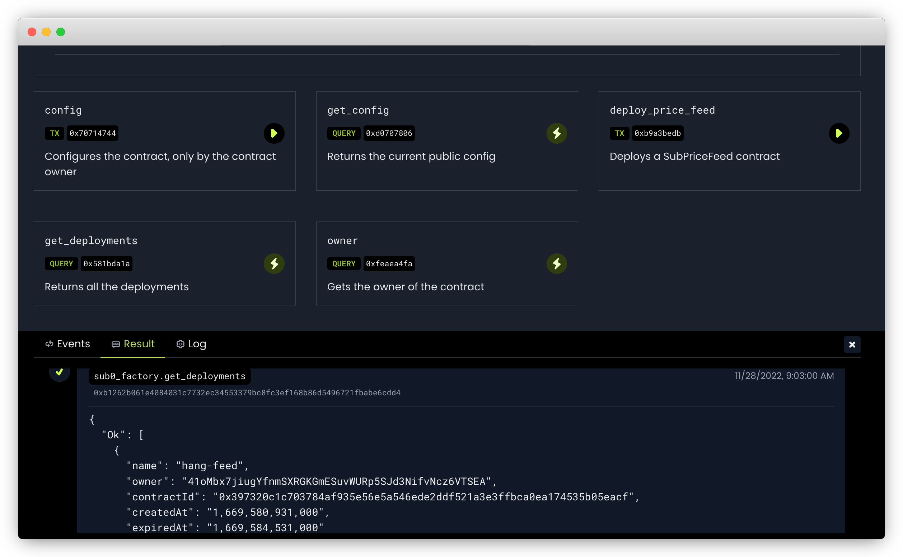

# Phat Contract Oracle Workshop
 
_First created for Sub0 2022 with the subtitle "Build an Oracle with Phat Contract"_ ([Slides](https://docs.google.com/presentation/d/1YdpiRHyhUtGeiN3zLWu5TpXuUbtV3UqWu7wTzpzbggA/edit#slide=id.p1))

## What you can learn

There are the beginner and advanced challenges in the workshop. In the beginner challenge, you are going to deploy a live **price feed oracle** on Phat Contract with the Web UI. In the advanced challenge, you are going to hack on the code to build your own customized oracle.

After this workshop, you will learn:

1. What the Phat Contract offchain computing is and how it can help build oracles
2. Fetch and process arbitrary data with HTTP(s) requests
3. Integrate to a Substrate blockchain
4. Implement the oracle in [ink!](https://ink.substrate.io/)

## Bonus

When you have solved a challenge successfully, you can earn a beautiful RMRK NFT.

| Beginner Award NFT | Advanced Award NFT |
| -------- | -------- |
|  |  |

---

# Beginner challenge

Before a deep dive into how an Phat Contract oracle is made, let's try to deploy a simple price feed oracle first. In this demo, you will use [Phat UI](https://phat.phala.network) to deploy your own price feed oracle, and connect it to a Substrate chain. Once the data arrives the blockchain, you will win a nice NFT as a bonus!


## Step-by-step

In this challenge, you will interact with the Phat Contract Web UI ([Phat UI](https://phat.phala.network)) in your browser. Before starting, please make sure you have the [Polkadot.js Browser Extension](https://polkadot.js.org/extension/) with a test account. If not, please follow our [Prepare Test Account](https://wiki.phala.network/en-us/build/getting-started/account-prep/) tutorial to create one.

> Some Polkadot.js Extension compatible extensions may also work, but this tutorial is only tested with the official extension.


Open [Phat UI](https://phat.phala.network). On the homepage, click _Connect Wallet_ on the right top corner, and choose the wallet you your using. The browser will pop up an _Authorize_ window. Click _Yes_ to allow the authorization. Then you can connect to one of your accounts in the _Select Account_ window. 


Once the account is connected, you can find the _Get Test-PHA_ button on the right side of the page. You can request 100 test token by clicking it. Please do if you haven't done it yet. The operations below require tokens as the transaction fee.

We are going to load the **Sub0Factory** contract and interact with it. `Sub0Factory` is a pre-configured contract to deploy price feed oracles. To load the contract, now you will need to download the [the metadata json file](https://github.com/Phala-Network/phat-offchain-rollup/blob/sub0-workshop/phat/artifacts/sub0_factory/metadata.json) of `Sub0Factory`.


In the Phat UI homepage, click the _Attach_ button. Drag & drop the `metadata.json` file (or the `.contract` file) to the _Contarct File_ section, enter the contract address, and click _Submit_ button.

```
0xb3142f57455558dd6f5c6b067ee49a71e1f5000813d64bf98427656270d05c85
```

> This is the address of the pre-deployed  `Sub0Factory` contract on the Phala public testnet (PoC-5). As of writing, it points to the latest deployment. However if the testnet get reset or migrated, the address may be changed. Please ask the Phala team if you believe it's out-of-date.


You are at the contract page if you have entered the page like above. In the contract page, you can see:

- Basic information: contarct id (address), source code info, and deploy info
- Tx methods: send transactions to call the method
- Query methods: send queries to call the method

Click the _play button_ in the tx method `deploy_price_feed()` to start the deployment. 


Now configure the oracle. The field `name` can be some arbitrary name. The field `token0` and `token1` forms the trading pair that you want to stream the price data to the blockchain. In the easy challenge, the price feed oracle reads the data from CoinGecko with the simple price api. For example, an oracle for trading pair **DOT/USD** can be set as:

- `token0`: `polkadot`
- `token1`: `usd`

You can find more on the [CoinGecko API](https://www.coingecko.com/en/api/documentation) page:

- The price api: API `/simple/price`
- Supported `token0`: API `/coins/list`
- Supported `token1`: API `/simple/supported_vs_currencies`

Click _Run_ button, sign the transaction and wait for a few seconds. The `Sub0Factory` contract will deploy a new price feed with your config. To check if the price feed is deployed, call the query `get_deployments()`. 



Open the _Result_ tab in the status bar at the bottom of the page. You should be able to see the query result, a list of the deployed price feed oracles. You can locate your oracle by the name and owner field. It also shows the `contractId` of the price feed, and its creation and expiration date. When the oracle is not expired, it will keep streaming the price data to the blockchain automatically (with the help of a scheduler, which will be covered later).

> In the workshop, for simplicity and fair usage of the resource, the price feed oracles will only be active for one hour. A production deployment can run for an arbitrary longer time.


Now, connect to the Phala testnet on [Polkadot.js Apps](https://polkadot.js.org/apps/?rpc=wss%3A%2F%2Fpoc5.phala.network%2Fws#/chainstate). Switch to _"Developer > Chain state"_ page. Select the storage `PhatOracle.priceFeeds`. It's a `StorageDoubleMap` with your wallet as the first key. Choose your wallet, disable the second key, then click the _(+)_ button. You will see the price quote being updated on the blockchain!

In the screenshot above, it shows the traiding pair `polkadot_usd` has a price of 5.31, represented by a `u128` integer with 12 decimals.

You can repeat the above steps to deploy more oracles. As long as there's a successful price quote stored on the Phala testnet, you will be awareded with a shining RMRK NFT automatically later. Congratulations!

Want to know how it works? We will cover this in the next section.

# Build an oracle in Phat Contract

## Prerequests

To read this section, it's suggested to have a basic understanding of the following concepts:

1. Smart contracts
2. Oracles
3. Blockchain Consensus
4. Offchain computation

## The way to scale oracles

Existing oracles don't scale. For instance, ChainLink is the most commonly used oracle. It supports only 12 EVM blockchains, and they struggle to add long-tail support. On the other hand, existing oracles often serve very limited data sources and functions (price feed and VRF). Though there are rich data available on the internet, none of the oracle is flexible enough to process this data and make it useful to blockchain apps.

The key to scale oracle is the ability to make its logic programmable. Thinking about building a customized oracle as easy as writing smart contracts, it would be easy to support all the long-tail blockchain and use cases.

Unfortunately, traditional oracles are not good at this because of their technical limitation. Oracle brings outside information to a blockchain. It must run off-chain because a blockchain can never access the data beyond its consensus system by itself. Without the consensus systems, the security guarantee disappears of a sudden. As a result, a decentralized off-chain project needs to take care to design the mechanism to ensure the correctness and the liveness of the network. Often, we cannot always find the mechanism that applies to all kinds of logic. Not to mention we may need to spend from months to years to implement it.

Is it possible to build a scalable oracle efficiently at all? It turns out possible, but we need an off-chain execution environment with:

1. Internet access: it enables access to all the data available around the world
2. Easy integration: can easily integrate to long-tail blockchains
3. Off-chain security: running off-chain, but still as secure as on-chain apps

Phat Contract is designed to meet all these requirements! As the decentralized offchain computation network for Web3, Phala allows you to deploy the customized program to access the internet and report data to any blockchain reliably.

## Phat Contract

Phat Contract is the programming model designed for offchain computation. It has some similarities to smart contracts but is fundamentally different from that.

To help understand, let's learn how Phala works. Phala Network is a network with thousands of secure off-chain workers. The workers are available to deploy apps. Unlike the fully redundant nodes in blockchain, Phala workers run the apps in parallel. The developer can pay one or more workers to deploy their app, just like how they deploy apps on the cloud.

This is possible because the workers are secure enough to run apps separately without involving blockchain consensus. Phat Contract is full off-chain computation. This gives us the following advantages:

1. Support internet access: Phat Contract provides API to send HTTP requests.
3. Low latency and CPU-intensive computation
4. Keep secrets: states and communications are protected by default
5. Direct cross-chain interoperation by RPC and transaction (Offchain Rollup)

Wanna learn more? Here are the useful links:

- [Phala Blockchain Details](https://wiki.phala.network/en-us/build/infrastructure/blockchain-detail/) explained yhy Phala workers are secure and confidentiality preserving
- [Why use it](https://wiki.phala.network/en-us/build/general/why-use-it/) discussed the unique features of Phat Contracts
- [Build Stateless Backend](https://wiki.phala.network/en-us/build/stateless/intro/) discussed the key difference of on-chain contracts and offchain computation
- [The ink! website](https://use.ink/) has everything you need to learn ink!, the programming language that also powers Phat Contract

With the above features, we can build decentralized oracles as easily as writing a backend app. In the advanced challenge, we will invite you to build you to build a custom oracle that can handle arbitrary request from the blockchain.

## Phat Contract is based on ink!

Phat Contract is based on [Parity ink!](https://use.ink/) and fully compatible with it. In addition, it has special extensions to support the unique features. Most of the time, developing Phat Contract is the same as writing ink! smart contract. So we strongly suggest learning ink! with [the official documentation](https://ink.substrate.io/) first. In this section, we will only cover the speical part of the price feed oracle.

## The primitives to build an oracle


The [`SubPriceFeed`](https://github.com/Phala-Network/phat-offchain-rollup/blob/main/phat/contracts/sub_price_feed/lib.rs) Phat Contract can be configured to fetch the price of a trading pair from CoinGecko with HTTP request. Then it sends the price to a blockchain with transactions.

### HTTP request

Phat Contract allows to send HTTP(s) request on the internet like below:

```rust
let url = format!("https://api.coingecko.com/api/v3/simple/price?ids={token0}&vs_currencies={token1}");
let headers = vec![("accept".into(), "application/json".into())];
// Send the request
let resp = pink::http_get!(url, headers);
if resp.status_code != 200 {
	return Err(Error::FailedToFetchPrice);
}
let body = resp.body;
```

The `http_get!` macro is provided by the Phat Contract API [`pink_extension::http_get`](https://docs.rs/pink-extension/0.2.0/pink_extension/macro.http_get.html). It allows the developer to send a `GET` or `POST` request in query context.

> In the transaction context, the http request will always fail, because it violates the determinism rule.

### Parsing JSON

It's possible to parse JSON objects in Phat Contract thanks to `serde` and `serde-json-core`. The code below parses the CoinGecko response to fixed point, and convert it to an integer representation:

```rust
let parsed: PriceResponse = pink_json::from_str(&json)
	.expect("failed to parse json");
// Parse to a fixed point and convert to u128 by rebasing to 1e12
let fp = fixed::types::U64F64::from_str(parsed.token0.token1)
	.expect("failed to parse real number");
let price = fp * 1_000_000_000_000u64.into();
```

Note that ink! contracts are written `no_std` rust. It doesn't support some `std` crates. However, thanks to the rich rust ecosystem, most of the common libraries can be reused. This is hard to imagine in traditional smart contract languages like Solidity.

### Access control & secret preserving

Secrets matter in offchain computation, because it's widely used for authentication. You may want to keep some API keys and private keys in the contract to access special service (e.g. a Telegram bot) and send transactions to a blockchain. Then we have to keep the secret securely.

Access control is a common pattern here. In Phat Contract, the states and the IO are confidentiality-preserving. Anyone except you can only see the end-to-end encrypted data but cannot guess the real content. We can easily write an access control logic like below to reject any unwanted access to the secret:

```rust
if self.env().caller() != self.admin {
    return Err(Error::BadOrigin);
}
return self.some_secret;
```

In the `SubPriceFeed` contract, the transaction submission wallet is the protected secret. It never leaves the Phat Contract.

### Offchain Rollup

Oracle doesn't work alone. We would always like an oracle to serve a blockchain. It means there needs read and write operations on the blockchain. In Phat Contract, it's easy to read chain states, sign and send transactions to the chain by RPC (with HTTP requests and secret preserving capabilities), just like running a blockchain client as a backend service.

However, it turns out just a blockchain client is far from useful. Both the Phat Contract offchain workers and the blockchains are distributed systems. All the interactions are made by async requests. It brings in the reliablity and concurrency control problem, just like any other distributed systems. Messaging channels between the systems are not enough. We need to build a reliable channel to guarantee the inter-operations are never missed, duplicated, or conflicted.

Just like TCP to UDP, we need to build a layer on the naive blockchain clients to implement [ACID transaction](https://en.wikipedia.org/wiki/ACID) on blockchains. Offchain Rollup is designed to achieve this goal.

In the Offchain Rollup design, the Phat Contract is connected to an "Anchor" on the target blockchain. The anchor can be implemented as a smart contract or pallet (on Substrate). The Phat Contract acts as a client, and the anchor acts as a kv database. The client is allowed to read from and write to the database. All the operations are wrapped in a rollup transaction. The rollup mechanism guarantee that conflicting transactions will be rejected. Thus it guarantees ACID.

From the high level, it's suggested to use Offchain Rollup to develop any Phat Contract that talks to a blockchain (as it guarantees ACID). The Offchain Rollup client provides the following features:

- Read: `client.session.read(key)`
- Write: `client.session.write(key, value)`
- Apply actions: `client.action(Action::Reply(data))`
- Commit and submit the tx: `client.commit_and_submit(chain, submitter_key_pair)`

On top of that, a rollup deployment can also implement Request-Response pattern. It allow the blockchain to send some requests, and let the Phat Contract to answer them (by making a queue in the database):

- Push a request on the blockchain: `Anchor::push_request(contract_id, request)`
- Read the request on Phat Contract: `client.pop_queue()`
- Anser the request on Phat Contract: `client.action(Action::Reply(response)`

The `SubPriceFeed` contract simply reply the price quote messages to the blockchain by rollup transactions:

```rust
// Get the price and respond as a rollup action.
let price = Self::fetch_coingecko_price(&config.token0, &config.token1)?;
let response = ResponseRecord {
	owner: self.owner.clone(),
	contract_id: contract_id.clone(),
	pair: format!("{}_{}", config.token0, config.token1),
	price,
	timestamp_ms: self.env().block_timestamp(),
};
// Attach an action to the tx by:
client.action(Action::Reply(response.encode()));
```

On the Substrate side, the pallet `PhatRollupAnchor` will receive and validate the rollup transaction. When it receives an `Action::Reply`, it will call the callback pallet that implemented `trait OnResponse`:

```rust
impl<T: Config> anchor::OnResponse<T::AccountId> for Pallet<T> {
	fn on_response(name: H256, submitter: T::AccountId, data: Vec<u8>) -> DispatchResult {
		let resp: ResponseRecord =
			Decode::decode(&mut &data[..]).or(Err(Error::<T>::FailedToDecodeResponse))?;
		// ...
		Self::deposit_event(Event::QuoteReceived {
			contract: name,
			submitter,
			owner: resp.owner,
			pair: resp.pair,
			price: resp.price,
		});
		Ok(())
	}
}
```

## Put everything together

With the HTTP request, JSON parser, access control, and Offchain Rollup, we can finally build a secure price feed oracle with less than 100 lines of code and deploy in minutes.

To learn more about the implementation, we suggest reading the full code of `SubPriceFeed`:

1. [`SubPriceFeed`](https://github.com/Phala-Network/phat-offchain-rollup/blob/main/phat/contracts/sub_price_feed/lib.rs)
2. [E2E Test](https://github.com/Phala-Network/phat-offchain-rollup/blob/main/phat/tests/substrate.test.ts)

## Hack the code

You can clone the full oracle repo:

```bash
git clone --branch sub0-workshop git@github.com:Phala-Network/phat-offchain-rollup.git
```

Then follow the [Development Guide](./Development.md) to initialize, build, and test the contracts.

To deploy the contract with [Phat UI](https://phat.phala.network), please check the Wiki page [Deploy Contract and Interact](https://wiki.phala.network/en-us/build/getting-started/deploy-contract/).

To connect the oracle to your own Substrate chain, you will need to import [`PhatRollupAnchor`](https://github.com/Phala-Network/phala-blockchain/blob/master/pallets/offchain-rollup/src/anchor.rs) to your runtime, and config the Phat Contract with a proper PRC to your full nodes.

## Resources

- Github Repo: <https://github.com/Phala-Network/oracle-workshop>
- Support
    - Discord (dev group): <https://discord.gg/phala-network>
    - Polkadot StackExchange (tag with `phala` and `phat-contract`): <https://substrate.stackexchange.com/>

---

# Advanced Challenge

（Coming soon)

---


# Troubleshooting

## Failed to compile with edition2021 error

> "ERROR: Error invoking cargo metadata", "feature `edition2021` is required"

Please make sure your rust toolchain is at the latest version by running:

```bash
rustup update
```

## Failed to compile with rustlib error

> error: ".../.rustup/toolchains/nightly-x86_64-unknown-linux-gnu/lib/rustlib/src/rust/Cargo.lock" does not exist, unable to build with the standard library

Try to add the `rust-src` component:

```bash
rustup component add rust-src --toolchain nightly
```

## Too old binaryen (wasm-opt)

> ERROR: Your wasm-opt version is 91, but we require a version >= 99

Please uninstall your current `binaryen` and reinstall the latest version from [the official repo](https://github.com/WebAssembly/binaryen/releases).